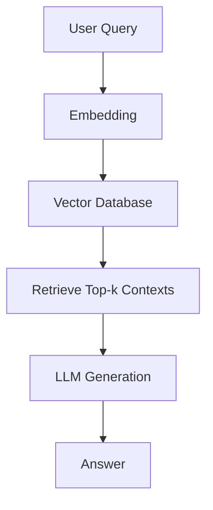

# 🚀 NeoRAG Cup 2025

## Tên kiến trúc
**Open-RAG ProPTIT** (Retrieval-Augmented Generation với OpenAI và MongoDB)

## Cấu trúc kiến trúc

- **Embedding:** Sử dụng module `embeddings.py` để chuyển đổi query và tài liệu thành vector embedding (Sử dụng OpenAI)
- **Vector Database:** Lưu trữ embedding bằng MongoDB, truy xuất các context liên quan nhất qua module `vector_db.py`.
- **Retrieval:** Truy xuất top-k context phù hợp với truy vấn từ vector database.
- **LLM Generation:** Sử dụng mô hình **gpt-4o-mini** của OpenAI để sinh câu trả lời dựa trên context đã truy xuất.
- **Evaluation:** Đánh giá hiệu năng hệ thống qua các metrics trong `metrics_rag.py`.

## Giới thiệu ngắn gọn về kiến trúc

**Opem-RAG ProPTIT** là pipeline RAG hiện đại, kết hợp khả năng truy xuất thông tin mạnh mẽ từ vector database với sức mạnh sinh ngôn ngữ tự nhiên của mô hình 4o-mini. Hệ thống cho phép trả lời các câu hỏi về CLB Lập Trình PTIT dựa trên dữ liệu nội bộ, đảm bảo câu trả lời vừa chính xác vừa tự nhiên.

## 📊 Benchmark

### **Retrieval – Train (100 query)** 
| K  | hit@k | recall@k | precision@k | f1@k | map@k | mrr@k | ndcg@k | context_precision@k | context_recall@k | context_entities_recall@k |
|----|-------|----------|-------------|------|-------|-------|--------|----------------------|------------------|---------------------------|
| 3  | 0.52  | 0.38     | 0.21        | 0.27 | 0.42  | 0.43  | 0.45   | 0.62                 | 0.50             | 0.31                      |
| 5  | 0.65  | 0.48     | 0.16        | 0.24 | 0.45  | 0.46  | 0.5    | 0.54                 | 0.44             | 0.33                      |
| 7  | 0.68  | 0.53     | 0.13        | 0.21 | 0.45  | 0.46  | 0.51   | 0.54                 | 0.40             | 0.36                      |

### **LLM Answer – Train (100 query)**
| K  | string_presence@k | rouge_l@k | bleu_4@k | groundedness@k | response_relevancy@k | noise_sensitivity@k |
|----|-------------------|-----------|----------|----------------|----------------------|---------------------|
| 3  | 0.37              | 0.16      | 0.02     | 0.54           | 0.78                 | 0.54                |
| 5  | 0.38              | 0.17      | 0.03     | 0.62           | 0.78                 | 0.56                |
| 7  | 0.4               | 0.15      | 0.04     | 0.6           | 0.80                  | 0.51                |

---

### **Retrieval – Test (30 query)**
| K  | hit@k | recall@k | precision@k | f1@k | map@k | mrr@k | ndcg@k | context_precision@k  | context_recall@k | context_entities_recall@k |
|----|-------|----------|-------------|------|-------|-------|--------|----------------------|------------------|---------------------------|
| 3  | 0.83  | 0.44     | 0.22        | 0.3  | 0.67  | 0.67  | 0.67   | 0.67                 | 0.78             | 0.29                      |
| 5  | 0.9   | 0.53     | 0.2         | 0.29 | 0.73  | 0.73  | 0.8    | 0.73                 | 0.73             | 0.32                      |
| 7  | 0.9   | 0.53     | 0.14        | 0.22 | 0.73  | 0.73  | 0.8    | 0.52                 | 0.57             | 0.35                      |

### **LLM Answer – Test (30 query)**
| K  | string_presence@k | rouge_l@k | bleu_4@k | groundedness@k | response_relevancy@k | noise_sensitivity@k |
|----|-------------------|-----------|----------|----------------|----------------------|---------------------|
| 3  | 0.31              | 0.46      | 0.15     | 0.67           | 0.82                 | 0.43                |
| 5  | 0.4               | 0.47      | 0.19     | 0.83           | 0.79                 | 0.4                 |
| 7  | 0.41              | 0.47      | 0.15     | 0.72           | 0.82                 | 0.53                |

---

### Giải thích các metrics

**hit@k**  
- **Ý nghĩa:** Tỷ lệ truy vấn mà kết quả đúng xuất hiện trong top-k kết quả trả về.  
- **Phản ánh:** Giá trị cao nghĩa là mô hình thường tìm được câu trả lời đúng trong top-k; giá trị thấp nghĩa là mô hình bỏ sót nhiều. Ưu điểm: dễ hiểu; nhược điểm: không xét vị trí chính xác trong top-k.

**recall@k**  
- **Ý nghĩa:** Tỷ lệ các câu trả lời đúng được tìm thấy trong top-k trên tổng số câu trả lời đúng.  
- **Phản ánh:** Cao → tìm được nhiều câu trả lời đúng; thấp → bỏ sót nhiều. Ưu điểm: đánh giá độ bao phủ; nhược điểm: không phản ánh độ chính xác.

**precision@k**  
- **Ý nghĩa:** Tỷ lệ câu trả lời đúng trong top-k kết quả.  
- **Phản ánh:** Cao → ít kết quả sai; thấp → nhiều kết quả nhiễu. Ưu điểm: đo độ chính xác; nhược điểm: không phản ánh số lượng câu trả lời tìm được.

**f1@k**  
- **Ý nghĩa:** Trung bình điều hòa của precision@k và recall@k.  
- **Phản ánh:** Cao → cân bằng tốt giữa độ chính xác và độ bao phủ; thấp → mất cân bằng. Ưu điểm: cân bằng hai yếu tố; nhược điểm: khó diễn giải nếu một chỉ số quá thấp.

**map@k (Mean Average Precision)**  
- **Ý nghĩa:** Trung bình của độ chính xác tại mỗi vị trí có kết quả đúng trong top-k.  
- **Phản ánh:** Cao → mô hình trả kết quả đúng ở vị trí cao; thấp → kết quả đúng nằm sâu. Ưu điểm: xét thứ tự kết quả; nhược điểm: tính toán phức tạp.

**mrr@k (Mean Reciprocal Rank)**  
- **Ý nghĩa:** Trung bình nghịch đảo của vị trí câu trả lời đúng đầu tiên trong top-k.  
- **Phản ánh:** Cao → câu trả lời đúng thường xuất hiện sớm; thấp → xuất hiện muộn. Ưu điểm: tập trung vào câu trả lời đúng đầu tiên; nhược điểm: bỏ qua các câu trả lời đúng khác.

**ndcg@k (Normalized Discounted Cumulative Gain)**  
- **Ý nghĩa:** Đo lường độ liên quan của kết quả, có xét vị trí trong top-k.  
- **Phản ánh:** Cao → kết quả liên quan ở vị trí cao; thấp → kết quả liên quan nằm sâu. Ưu điểm: phản ánh tốt thứ hạng; nhược điểm: cần thông tin độ liên quan.

**context_precision**  
- **Ý nghĩa:** Tỷ lệ thông tin ngữ cảnh được truy xuất là chính xác.  
- **Phản ánh:** Cao → ít thông tin dư thừa; thấp → nhiều nhiễu. Ưu điểm: đo độ sạch dữ liệu ngữ cảnh; nhược điểm: không xét độ đầy đủ.

**context_recall**  
- **Ý nghĩa:** Tỷ lệ thông tin ngữ cảnh đúng được lấy ra so với tổng số thông tin đúng.  
- **Phản ánh:** Cao → lấy được nhiều thông tin quan trọng; thấp → bỏ sót nhiều. Ưu điểm: đo độ bao phủ ngữ cảnh; nhược điểm: không phản ánh độ chính xác.

**context_entities_recall@k**  
- **Ý nghĩa:** Tỷ lệ thực thể (entities) đúng xuất hiện trong ngữ cảnh top-k.  
- **Phản ánh:** Cao → hầu hết thực thể cần thiết xuất hiện; thấp → nhiều thực thể bị thiếu. Ưu điểm: phù hợp cho bài toán yêu cầu thông tin thực thể; nhược điểm: phụ thuộc vào chất lượng nhận diện thực thể.

**string_presence@k**  
- **Ý nghĩa:** Tỷ lệ câu trả lời chứa đúng chuỗi ký tự kỳ vọng trong top-k.  
- **Phản ánh:** Cao → câu trả lời khớp trực tiếp với đáp án mong muốn; thấp → ít khớp. Ưu điểm: đơn giản; nhược điểm: không xét ý nghĩa tương đồng.

**rouge_l@k**  
- **Ý nghĩa:** Độ trùng khớp theo chuỗi con chung dài nhất (Longest Common Subsequence) giữa câu trả lời và đáp án.  
- **Phản ánh:** Cao → câu trả lời gần giống đáp án; thấp → ít trùng khớp. Ưu điểm: đánh giá tốt độ bao phủ; nhược điểm: không xét thứ tự chính xác toàn phần.

**bleu_4@k**  
- **Ý nghĩa:** Độ trùng khớp n-gram (4-gram) giữa câu trả lời và đáp án.  
- **Phản ánh:** Cao → câu trả lời sát ngữ cảnh đáp án; thấp → khác biệt lớn. Ưu điểm: phổ biến trong NLP; nhược điểm: nhạy với thay đổi nhỏ về từ ngữ.

**groundedness@k**  
- **Ý nghĩa:** Mức độ câu trả lời dựa trên thông tin đã truy xuất.  
- **Phản ánh:** Cao → ít thông tin bịa; thấp → nhiều thông tin ngoài ngữ cảnh. Ưu điểm: đánh giá tính tin cậy; nhược điểm: khó đo tự động chính xác.

**response_relevancy**  
- **Ý nghĩa:** Mức độ liên quan của câu trả lời với câu hỏi.  
- **Phản ánh:** Cao → câu trả lời phù hợp; thấp → lạc đề. Ưu điểm: phản ánh trải nghiệm người dùng; nhược điểm: cần đánh giá thủ công hoặc mô hình phụ.

**noise_sensitivity@k**  
- **Ý nghĩa:** Mức độ mô hình bị ảnh hưởng bởi dữ liệu nhiễu trong top-k.  
- **Phản ánh:** Cao → dễ bị nhiễu tác động; thấp → mô hình ổn định hơn. Ưu điểm: giúp kiểm tra khả năng chống nhiễu; nhược điểm: khó tính toán nếu không có dữ liệu nhiễu rõ ràng.

### Điểm nổi bật (điểm mạnh)

- **Linh hoạt embedding:** Hỗ trợ nhiều loại embedding (OpenAI, Gemini, ...), dễ dàng mở rộng.
- **Truy xuất nhanh:** Sử dụng MongoDB cho lưu trữ và truy xuất vector hiệu quả.
- **Sinh ngôn ngữ tự nhiên:** Tích hợp Gemma 2B (HuggingFace) cho chất lượng trả lời tốt, dễ tùy biến prompt.
- **Đánh giá toàn diện:** Hệ thống metrics đa dạng, đánh giá cả retrieval lẫn generation.
- **Dễ mở rộng:** Cấu trúc module rõ ràng, dễ tích hợp thêm model hoặc database mới.

### Hạn chế

- **Phụ thuộc tài nguyên:** Gemma 2B yêu cầu tài nguyên tính toán lớn, có thể chậm trên máy không GPU.
- **Chưa tối ưu cho dữ liệu lớn:** MongoDB phù hợp với quy mô vừa, với dữ liệu cực lớn cần cân nhắc giải pháp vector DB chuyên dụng hơn (Pinecone, FAISS...).
- **Chưa có reranking:** Pipeline hiện tại chưa tích hợp bước reranking context nâng cao.
- **Chưa tối ưu hóa prompt động:** Prompt sinh câu trả lời còn tĩnh, chưa cá nhân hóa sâu theo từng truy vấn.